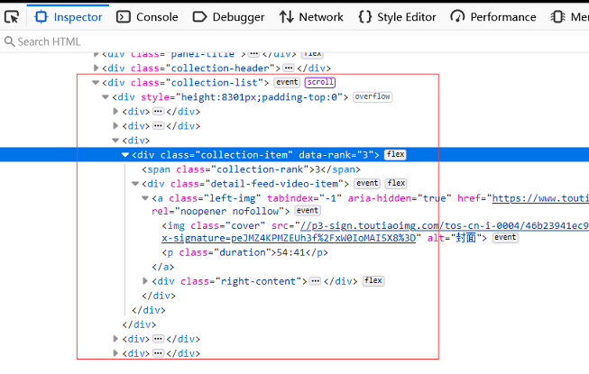

# toutiao_scrape
A python script (python v3+) does scraping video list from Toutiao (Toutiao or Jinri Toutiao is a Chinese news and information content platform, a core product of the China-based company ByteDance）

Basically, you'll need to firstly prepare a static HTML file - **mid_school_grade8_math.htm** that contains the video list such as HTML structure like &lt;div class="detail-feed-video-item"&gt;...&lt;/div&gt;
(you should catch the video list by viewing html source in browser, see below.)




literally, the static html file name means a certain video list for the middle scholl grade 8 math, but you can put any video list written in HTML tagging format.

The main scraping script you run is **toutiao_video_collection.py**
```
python toutiao_video_collection.py
```

Before running the main script, you probably need to modify the **_cookie**[^note] variable that you extract it from your browser > inspector tool > network (when you visited any video page)

[^note]:
    WITHOUT the **_cookie**, when loading the video page in the python script, it will return the 'noscript' declaration instead of actual HTML content.


## Required python libs
```
pip install simplejson
pip install lxml
```

## Peformance
Most of videos have been separated as video / audio files (i.e, extension .mp4 with video frames and extension .m4a with audio)
after scraping the two video / audio files, then [ffmpeg](https://ffmpeg.org/download.html) does combine them as a single final video file as quite quickly using the method **c:v copy c:a copy**
the [moviepy](https://pypi.org/project/moviepy/) has ability to do same combination, but it's quite slowly, so it's not recommended in the use.

# Warning
You can use the codes for free for personal purpose only, you will be responsible for any legal suit in commercial usage.
